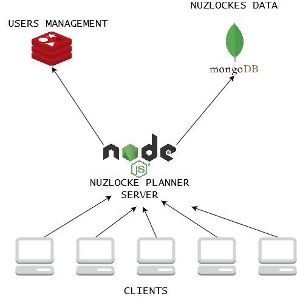

# Nuzlocke Planner Server


Server for nuzlocke planner app. Build with NodeJS.

## Server architecture



Important facts of server architecture:
- The data has been stored in NoSql databases in order to scale horizontally in case it is needed and easier migrate data structure.
- Polyglot persistence to fit the data needs.
- NodeJS at server side because it is easy to code, there're a lot of openb source modules and its async flow makes it really fast handling http requests.

### Users management

Users data is stored on a Redis database.

The database is managed by the package [users-management-redis](https://github.com/guillem96/user-management-redis) developed by [me](https://github.com/guillem96).

### Nuzlockes data

The data related to nuzlockes, pokemon, locations... is stored in a MongoDB database.

The database connection is managed using [mongoose](https://mongoosejs.com/). 

## Endpoints

### Auth endpoint

Endpoints related to user management.
#### Create account

- Method: POST
- URL: /auth/signup
- Body: 
```javascript
{ 
  username: string,
  password: string,
  name: string,
  surname: string,
  email: string 
} 
```
- Response:
```javascript
{
  status: number,
  msg: string,
  id: number // User id
}
```

#### Get info from any user

- Method: GET
- URL: /auth/user/<-username->
- Response:
```javascript
{
  username: string,
  name: string,
  surname: string,
  email: string
}
```

#### Login to get token

- Method: POST
- URL: /auth/login
- Body: 
```javascript
{ 
  username: string,
  password: string,
} 
```
- Response:
```javascript
{
  user: {
    username: string,
    password: string,
    name: string,
    surname: string,
    email: string
  },
  token: string // Auth token to use in bearer token authentication
}
```

#### Delete account

- Method: DELETE
- URL: /auth/
- Authorization: Bearer token
- Response:
```javascript
{
  status: number,
  msg: string
}
```

### Nuzlocke endpoint

#### List nuzlockes

- Method: GET
- URL: /nuzlocke/
- Authorization: Bearer Token
- Response:
```javascript
Array<NuzlockeSchema>
```

#### Get a nuzlocke

- Method: GET
- URL: /nuzlocke/<-nuzlocke_id->
- Authorization: Bearer Token
- Response:
```javascript
NuzlockeSchema
```

#### Create a new nuzlocke
- Method: POST
- URL: /nuzlocke/
- Authorization: Bearer Token
- Body: 
```javascript
{ 
  generation: string,
  game_name: string,
  version_group: string, // Version group of game
  gender: string, // male or female
  trainer_name: string
} 
```
- Response:
```javascript
{
  user: {
    username: string,
    password: string,
    name: string,
    surname: string,
    email: string
  },
  nuzlocke: NuzlockeSchema
}
```

#### Delete nuzlocke
- Method: DELETE
- URL: /nuzlocke/<-nuzlocke_id->
- Authorization: Bearer Token
```
- Response:
```javascript
{
  msg: string,
  nuzlocke: NuzlockeSchema
}
```

#### Add an entry to nuzlocke pokedex
- Method: POST
- URL: /nuzlocke/<-nuzlocke_id->/pokedex
- Authorization: Bearer Token
- Body: 
```javascript
{ 
  dex_number: number,
  found_at: number, // Location id
  nickname: string
} 
```
- Response:
```javascript
NuzlockeSchema
```

#### Delete an entry from nuzlocke pokedex
- Method: DELETE
- URL: /nuzlocke/<-nuzlocke_id->/pokedex/<-pokemon_id->
- Authorization: Bearer Token
- Response:
```javascript
NuzlockeSchema
```

#### Update team
- Method: POST
- URL: /nuzlocke/:id/team
- Authorization: Bearer Token
- Body:
```javascript
Array<PokemonSchema>
```
- Response:
```javascript
NuzlockeSchema
```

#### Mark a pokemon as defeated
- Method: POST
- URL: /nuzlocke/:id/pokedex/:pkmId/defeated
- Authorization: Bearer Token
- Response:
```javascript
NuzlockeSchema
```

#### <a name="schemas"></a> Schemas

*GameSchema*
```javascript
{
  generation: string,
  version_group: string,
  name: string
}
```

*PokemonSchema*
```javascript
{
  dex_number: string,
  found_at: string,
  nickname: string,
  is_defeated: boolean
}
```

*NuzlockeSchema*
```javascript
{
  game: GameSchema,
  gender: string,
  trainer_name: string,
  pokemon: Array<PokemonSchema>,
  team: Array<PokemonSchema>,
  created_at: Date
}
```

## Useful npm modules

In this section I will mention the npm modules that have been really helpful during the development.
- [](https://www.npmjs.com/package/async)
- [](https://www.npmjs.com/package/express)
- [](https://mongoosejs.com/)

